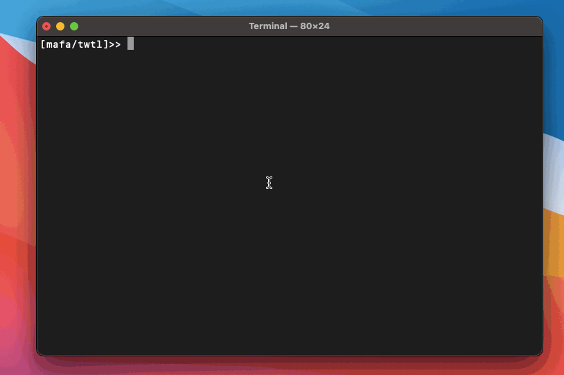

# Table of Contents

-   [A Small Demo](#org35ea5d9)
-   [Installation](#org8e8828b)
    -   [Prerequisite](#org3bb85db)
    -   [Option 1: Cargo install (recommended)](#org5748bf6)
    -   [Option 2: Build from source](#orgddb2702)
    -   [Option 3: Prebuilt binaries](#orgc82a299)
-   [Mafa is for me?](#orgf025c7c)
-   [What is Mafa](#org06953ca)
    -   [How Mafa works](#orgf689b1f)
    -   [Why Mafa](#orgc178c16)
    -   [About Mafa](#orgd214b20)
-   [Supported components ](#org2c3e881)
    -   [What about website "&#x2026;"?](#org17e3f66)
-   [Contributing](#org6c439f0)
-   [License](#org814b32e)

# A Small Demo

*(captured by [LICEcap](https://www.cockos.com/licecap/))*

# Installation

## Prerequisite

Mafa does not work alone, below are programs that it
depends on:

1.  firefox (91 or later)

2.  curl (any version)

3.  tar (any version)

4.  gzip (any version)

## Option 1: Cargo install (recommended)

This is recommended because by `cargo install`, you always get the
latest stable version of Mafa.

If you have Cargo installed, then you can

    cargo install mafa
    
    # check installed version
    mafa --version

## Option 2: Build from source

    # grab the source
    git clone https://github.com/imichael2e2/mafa
    
    # into source directory
    cd mafa
    
    # build
    cargo build --release --features imode,twtl,gtrans
    
    # check built version
    ./target/release/mafa --version

## Option 3: Prebuilt binaries

Check [releases](https://github.com/imichael2e2/mafa/releases).

# Mafa is for me?

Mafa is developed for the ones who want to benefit from Web's openness
as much as possible.

However, Mafa is **NOT** for you if

-   You want to browse websites without a web browser. (Mafa needs
    Firefox)

-   You want to capture every detail of a website. (Use your favorite
    web browser directly)

-   You plan to crawl a whole website and extract all its
    data. (A dedicated web crawler does a better job)

# What is Mafa

Mafa is a command-line tool that helps people interact with online
websites in a terminal(tty). It accesses websites through
*components*. Components are child programs that rely on [WebDriver](https://www.w3.org/TR/webdriver) to do
their job. Each module has a fixed, predefined website url and has a 
specific task for that site. With components, users can browse websites
without interacting with web browsers directly.

Note that Mafa supports wbsites selectively rather than arbitrarily,
the selected ones are listed in [below](#orga259726).  

## How Mafa works

Mafa leverages [WebDriver](https://www.w3.org/TR/webdriver) to achieve its goals. More specifically,
Mozilla's [GeckoDriver](https://github.com/mozilla/geckodriver) is in use. With WebDriver, Mafa
can act like a human, browsing websites naturally for its user. 

## Why Mafa

### Usable & Convenient

Unlike other counterparts, Mafa strives to balance usability and
convenience: Mafa will try its best to finish the task on its own or
instruct users to open web browser directly if it cannot
perfectly handle the situation(such as in cases where the website
is equipped with CAPTCHA or requires user login). What Mafa tries to
be is a browser companion, **not** a replacement.

### Neutral

The underlying WebDriver backs by a nearly full-functional web
browser. Overall, Mafa default **not** to subjectively strip any feature
a website user or provider can take advantage of, just like on a
normal full-functional web browser.

Therefore there is no reason for providers to particularly prevent
Mafa from accessing their websites, which likely leads to a negative
result for **both** sides. 

It is noteworthy that Mafa does not wipe out the user identity by
default, as a regular web browser does. It is essential for website
providers because while many websites abuse user privacy, there are
always ones collecting it for a good reason, such as [Ecosia](https://www.ecosia.org).

### Stable & Long-lasting

One of Mafa's goals is to handle websites stably for a relatively long
period. Modern web pages are famous for their dynamic characteristic.
However, Mafa can handle those dynamic and unpredictable
web pages as effortlessly as the static ones. 

## About Mafa

Although Mafa is initially developed for (**M**)aking (**A**)PI (**F**)ree
(**A**)gain, it is not realistic. Instead of freeing APIs, Mafa
frees the text-form data behind the APIs. Here "free" is the same word
defined in [What is Free Software?](https://www.gnu.org/philosophy/free-sw.en.html), i.e., as in "free speech", not as
in "free beer".

Some websites provide their data *publicly* but do not 
publish corresponding APIs to access it, while others offer their data
*publicly* in their carefully designed websites and APIs but with even
more carefully designed pricing. Those websites are blocking users
from accessing their *public* data by either not providing APIs or
providing ones with non-trivial barriers, examples of disrespecting
users' freedom.

Mafa is the one who commits to protexting web users' freedom. It
tries its best to achieve the initial goal: as long as the data is
publicly accessible to all users without discrimination, the APIs to
access it should be as well. 

# Supported components 

-   TWTL: Query Twitter users' timeline.

-   GTRANS: Query translation from Google Translate.

-   CAMD: Query word definition from Cambridge Dictionary.

-   IMODE: Interactive mode.

## What about website "&#x2026;"?

Yes! Mafa is open in its heart. If your favorite websites are not
listed here, you can submit a feature request or write a Mafa
component for your favorite website, as long as that site meets the
following requirements: 

1.  It will not shut down in the foreseeable future.
2.  The valuable data on it is in text form.

# Contributing

Mafa is still in early development, any contribution is welcomed!

# License

Mafa is proudly licensed under GPLv3.

See LICENSE-GPL for details.

